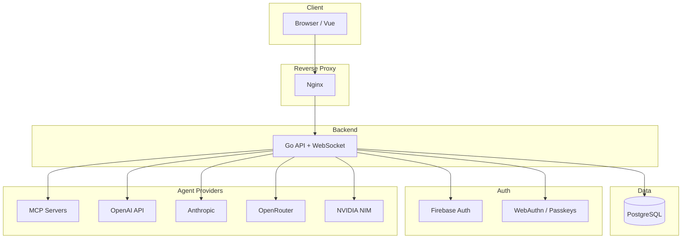

# Benchmarking Platform

A production-grade, multi-tenant benchmarking platform for evaluating AI agents across multiple providers (OpenAI, Anthropic, OpenRouter, NVIDIA, MCP, and OpenAI-compatible APIs).

## Quick Start

### Using Docker Compose (Recommended)

```bash
# Development: Build and start all services
docker-compose up --build

# With frontend hot-reload (Vite dev server)
docker-compose --profile dev up --build

# Production: Database + Go API only (frontend typically deployed separately)
docker-compose -f docker-compose.prod.yml up -d
```

**Development** (`docker-compose.yml`) starts:
- **PostgreSQL** (internal, no exposed port)
- **Go API** on port `8080`
- **Frontend** on port `3010` (production build) or `frontend-dev` with hot-reload when using `--profile dev`

**Production** (`docker-compose.prod.yml`) starts:
- **PostgreSQL** (internal)
- **Go API** (behind reverse proxy)


### Verify Services

```bash
# Check Go API health
curl http://localhost:8080/health
```

### Database Migrations

The platform includes an automated migration runner. Place SQL migration files in `server_go/migrations/` (naming convention: `XXX_description.sql`). They are automatically applied on server startup.

- **Initial Schema**: `server_go/migrations/001_initial_schema.sql` contains the baseline database structure.

### Docker Configuration

The project supports two main environments:

- **Development** (`docker-compose.yml`):
  - Hot-reloading for Frontend (Vite)
  - Debug ports exposed
  - Local volume mounts

- **Production** (`docker-compose.prod.yml`):
  - Optimized production builds (Nginx serving static files)
  - Secure proxy configuration
  - Minimized container images

### Maintenance & Reset

Use the included `reset.sh` script for environment management:

```bash
# Default: Resets Database only (Fast)
./reset.sh

# Soft Reset: Rebuilds containers, preserves DB data
./reset.sh --soft-reset

# Hard Reset: Wipes DB volume, rebuilds everything (Fresh Start)
./reset.sh --hard-reset

# Deploy to Production
./reset.sh --prod
```

### Proxy Access Password (Basic Auth)

To protect dev/prod proxy access behind an extra password gate:

```bash
# 1) Generate/update credentials + protected hosts (local only, not committed)
./scripts/set-basic-auth.sh <username> <password> <domain[,domain2,...]>

# 2) Deploy production
./reset.sh --prod
```

Notes:
- Credentials are stored in `ops/nginx/.htpasswd` (gitignored).
- Protected hosts are stored in `ops/nginx/.basic-auth-hosts.map` (gitignored).
- Both proxies (`ops/nginx/nginx.conf` and `ops/nginx/nginx.prod.conf`) enforce HTTP Basic Auth only for hosts listed in that local map.
- Examples without real secrets/domains: `ops/nginx/.htpasswd.example` and `ops/nginx/.basic-auth-hosts.map.example`.
- Rollback: remove the auth directives from `ops/nginx/nginx.prod.conf` and redeploy `./reset.sh --prod`.

## API Architecture

This platform uses a **WebSocket-first architecture**. All real-time operations (agents, question sets, runs, evaluations, stats) are handled via WebSocket messages.

### REST Endpoints (Minimal)

Only essential auth endpoints use REST:

| Method | Endpoint | Description |
|--------|----------|-------------|
| GET | `/health` | Health check |
| POST | `/auth/register` | Legacy registration (Dev only) |
| POST | `/auth/login` | Legacy login (Dev only) |
| POST | `/auth/bootstrap-admin` | Create initial admin |
| GET | `/auth/check-admin` | Check if admin exists |
| GET | `/auth/me` | Get current user (protected) |
| POST | `/auth/refresh` | Refresh JWT token (protected) |
| POST | `/auth/logout` | Logout (protected) |
| POST | `/auth/join-organization` | Join org via invite (protected) |
| POST | `/auth/select-organization` | Switch organization (protected) |

### WebSocket API

| Endpoint | Description |
|----------|-------------|
| `GET /ws?token=<jwt>&workspace_id=<uuid>` | Main WebSocket connection |

All messages use a standard envelope: `{ "type": "REQ_*", "correlation_id": "...", "payload": {...} }`. For a complete reference of every message type (REQ_*, CMD_*, DATA_*, EVT_*), payloads, and responses, see **[docs/websocket-messages.md](docs/websocket-messages.md)**.

### Supported Agent Providers

| Provider | Required Config Keys | Notes |
|----------|----------------------|-------|
| `mcp` | `endpoint`, `token` | Model Context Protocol (HTTP) |
| `openai` | `api_key` | Managed (prompt_id) or standard (model) |
| `openai_compatible` | `api_key`, `base_url` | Any OpenAI-compatible API |
| `openrouter` | `api_key` | Optional: model, base_url, system_prompt |
| `nvidia` | `api_key` | NVIDIA NIM; optional model, base_url |
| `anthropic` | `api_key` | Claude; optional model, base_url |
| `evaluator` | Resolves to one of above | Auto-extracts scores from responses |

## Environment Variables

| Variable | Default | Description |
|----------|---------|-------------|
| `DATABASE_URL` | — | PostgreSQL connection string |
| `JWT_SECRET` | — | JWT signing secret (min 32 chars) |
| `ENCRYPTION_KEY` | — | AES key for encrypted agent configs. Preferred: raw 32 chars. Compatibility: raw 16/24/32 chars or hex 32/48/64 chars |
| `PORT` | `8080` | API port |
| `APP_ENV` | `development` | `development` or `production` (disables dev features) |
| `FIREBASE_SERVICE_ACCOUNT` | — | Path to Firebase Service Account JSON |
| `ALLOWED_ORIGINS` | — | Comma-separated CORS origins (production) |
| `VITE_AFK_TIMEOUT_MS` | `180000` | Frontend idle timeout (ms) before WebSocket disconnect |
| `VITE_HMR_HOST`, `VITE_HMR_CLIENT_PORT`, `VITE_HMR_PROTOCOL` | — | Optional HMR config for dev behind proxy |

## Development

### Run Tests

```bash
# Backend Tests
cd server_go
go test ./... -v

# Frontend Tests
cd frontend
npm run test
```

### Run Without Docker

```bash
# Terminal 1: Start Postgres
docker run -d -p 5432:5432 -e POSTGRES_PASSWORD=postgres -e POSTGRES_DB=benchmarking postgres:15

# Terminal 2: Start Go API
cd server_go
export DATABASE_URL="host=localhost user=postgres password=postgres dbname=benchmarking port=5432 sslmode=disable"
export FIREBASE_SERVICE_ACCOUNT="./firebase-service-account.json"
go run .
```

Place `firebase-service-account.json` in `server_go/` before running. Without it, Firebase-based login will fail.

## Architecture



High-level flow: Browser connects via Nginx (proxy). Go API handles REST + WebSocket, persists to PostgreSQL, authenticates via Firebase/WebAuthn, and executes benchmark tasks by calling external agent providers (MCP, OpenAI, Anthropic, etc.).

## Documentation

- **[docs/websocket-messages.md](docs/websocket-messages.md)** — Complete reference of all WebSocket envelope messages (REQ_*, CMD_*, DATA_*, EVT_*)
- **[docs/websocket-api.md](docs/websocket-api.md)** — WebSocket API guide (connection, handshake, examples)
- **[docs/db_schema.md](docs/db_schema.md)** — Database schema diagram

## License

Licensed under the Apache License 2.0. See `LICENSE` for details.
