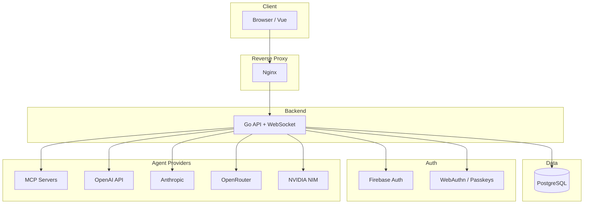

# Benchmarking Platform

A production-grade, multi-tenant benchmarking platform for evaluating AI agents across multiple providers (OpenAI, Anthropic, OpenRouter, NVIDIA, MCP, and OpenAI-compatible APIs).

## Quick Start

### Using Docker Compose (Recommended)

```bash
# Development: Build and start all services
docker-compose up --build

# With frontend hot-reload (Vite dev server)
docker-compose --profile dev up --build

# Production: Database + Go API only (frontend typically deployed separately)
docker-compose -f docker-compose.prod.yml up -d
```

**Development** (`docker-compose.yml`) starts:
- **PostgreSQL** (internal, no exposed port)
- **Go API** on port `8080`
- **Frontend** on port `3010` (production build) or `frontend-dev` with hot-reload when using `--profile dev`

**Production** (`docker-compose.prod.yml`) starts:
- **PostgreSQL** (internal)
- **Go API** (behind reverse proxy)


### Verify Services

```bash
# Check Go API health
curl http://localhost:8080/health
```

### Database Migrations

The platform includes an automated migration runner. Place SQL migration files in `server_go/migrations/` (naming convention: `XXX_description.sql`). They are automatically applied on server startup.

- **Initial Schema**: `server_go/migrations/001_initial_schema.sql` contains the baseline database structure.

### Docker Configuration

The project supports two main environments:

- **Development** (`docker-compose.yml`):
  - Hot-reloading for Frontend (Vite)
  - Debug ports exposed
  - Local volume mounts

- **Production** (`docker-compose.prod.yml`):
  - Optimized production builds (Nginx serving static files)
  - Secure proxy configuration
  - Minimized container images

### Maintenance & Reset

Use the included `reset.sh` script for environment management:

```bash
# Default: Resets Database only (Fast)
./reset.sh

# Soft Reset: Rebuilds containers, preserves DB data
./reset.sh --soft-reset

# Hard Reset: Wipes DB volume, rebuilds everything (Fresh Start)
./reset.sh --hard-reset

# Deploy to Production
./reset.sh --prod
```

### Proxy Access Password (Basic Auth)

To protect dev/prod proxy access behind an extra password gate:

```bash
# 1) Generate/update credentials + protected hosts (local only, not committed)
./scripts/set-basic-auth.sh <username> <password> <domain[,domain2,...]>

# 2) Deploy production
./reset.sh --prod
```

Notes:
- Credentials are stored in `ops/nginx/.htpasswd` (gitignored).
- Protected hosts are stored in `ops/nginx/.basic-auth-hosts.map` (gitignored).
- Both proxies (`ops/nginx/nginx.conf` and `ops/nginx/nginx.prod.conf`) enforce HTTP Basic Auth only for hosts listed in that local map.
- Examples without real secrets/domains: `ops/nginx/.htpasswd.example` and `ops/nginx/.basic-auth-hosts.map.example`.
- Rollback: remove the auth directives from `ops/nginx/nginx.prod.conf` and redeploy `./reset.sh --prod`.

## API Architecture

This platform uses a **WebSocket-first architecture**. All real-time operations (agents, question sets, runs, evaluations, stats) are handled via WebSocket messages.

### REST Endpoints (Minimal)

Only essential auth endpoints use REST:

| Method | Endpoint | Description |
|--------|----------|-------------|
| GET | `/health` | Health check |
| POST | `/auth/register` | Legacy registration (Dev only) |
| POST | `/auth/login` | Legacy login (Dev only) |
| POST | `/auth/bootstrap-admin` | Create initial admin |
| GET | `/auth/check-admin` | Check if admin exists |
| GET | `/auth/me` | Get current user (protected) |
| POST | `/auth/refresh` | Refresh JWT token (protected) |
| POST | `/auth/logout` | Logout (protected) |
| POST | `/auth/join-organization` | Join org via invite (protected) |
| POST | `/auth/select-organization` | Switch organization (protected) |

### WebSocket API

| Endpoint | Description |
|----------|-------------|
| `GET /ws?token=<jwt>&workspace_id=<uuid>` | Main WebSocket connection |

All messages use a standard envelope: `{ "type": "REQ_*", "correlation_id": "...", "payload": {...} }`. For a complete reference of every message type (REQ_*, CMD_*, DATA_*, EVT_*), payloads, and responses, see **[docs/websocket-messages.md](docs/websocket-messages.md)**.

### Supported Agent Providers

| Provider | Required Config Keys | Notes |
|----------|----------------------|-------|
| `mcp` | `endpoint`, `token` | Model Context Protocol (HTTP) |
| `openai` | `api_key` | Managed (prompt_id) or standard (model) |
| `openai_compatible` | `api_key`, `base_url` | Any OpenAI-compatible API |
| `openrouter` | `api_key` | Optional: model, base_url, system_prompt |
| `nvidia` | `api_key` | NVIDIA NIM; optional model, base_url |
| `anthropic` | `api_key` | Claude; optional model, base_url |
| `evaluator` | Resolves to one of above | Auto-extracts scores from responses |

## Environment Variables

| Variable | Default | Description |
|----------|---------|-------------|
| `DATABASE_URL` | — | PostgreSQL connection string |
| `JWT_SECRET` | — | JWT signing secret (min 32 chars) |
| `ENCRYPTION_KEY` | — | AES key for encrypted agent configs. Preferred: raw 32 chars. Compatibility: raw 16/24/32 chars or hex 32/48/64 chars |
| `ENCRYPTION_KEY_PREVIOUS` | — | Previous AES key kept temporarily during rotation so existing encrypted configs can still be read and re-encrypted |
| `ENCRYPTION_KEY_ROTATE_ON_START` | `false` | When `true`, the backend re-encrypts supported encrypted columns from `ENCRYPTION_KEY_PREVIOUS` to `ENCRYPTION_KEY` during startup |
| `PORT` | `8080` | API port |
| `APP_ENV` | `development` | `development` or `production` (disables dev features) |
| `FIREBASE_SERVICE_ACCOUNT` | — | Path to Firebase Service Account JSON |
| `ALLOWED_ORIGINS` | — | Comma-separated CORS origins (production) |
| `VITE_AFK_TIMEOUT_MS` | `600000` | Frontend idle timeout (ms) before WebSocket disconnect (min: 60000; tripled during active runs) |
| `VITE_HMR_HOST`, `VITE_HMR_CLIENT_PORT`, `VITE_HMR_PROTOCOL` | — | Optional HMR config for dev behind proxy |

## Encryption Key Rotation

The application currently encrypts only these database fields:

- `agents.config`
- `question_set_agents.config`

Other user-facing records such as user names, emails, login logs, run answers, evaluations, and question set data are not protected by `ENCRYPTION_KEY`.

### What Exists Today

- The app accepts `ENCRYPTION_KEY` as raw AES key material (`16`, `24`, or `32` chars) or as hex (`32`, `48`, or `64` chars).
- When `ENCRYPTION_KEY_PREVIOUS` is configured, decrypt reads try the active key first and then the previous key.
- New writes always use `ENCRYPTION_KEY`.
- When `ENCRYPTION_KEY_ROTATE_ON_START=true`, startup attempts an in-place re-encryption of:
  - `agents.config`
  - `question_set_agents.config`
- The startup rotator uses a PostgreSQL advisory lock so only one instance performs the rewrite during a rollout.
- On startup, the backend stores a non-reversible fingerprint of the active key plus a sentinel ciphertext in `encryption_key_states`.
- The Admin Debug view shows:
  - current key status and detected format
  - current fingerprint prefix
  - stored fingerprint prefix
  - whether the current key matches the persisted state
  - whether sentinel verification succeeded

This allows the system to detect future key changes or read/decrypt incompatibilities.

### Safe Rotation Procedure

Use this procedure when encrypted configs must be preserved and you want the deploy itself to perform the migration.

1. Confirm the current deployment is healthy in Admin Debug:
   - key status is `loaded`
   - key state status is `match`
   - no unexpected decrypt failures in `agents.config` or `question_set_agents.config`
2. Deploy the new revision with:
   - `ENCRYPTION_KEY` = new key
   - `ENCRYPTION_KEY_PREVIOUS` = old key
   - `ENCRYPTION_KEY_ROTATE_ON_START=true`
3. Let startup perform the migration:
   - reads `agents.config` and `question_set_agents.config`
   - decrypts each value with the old key when needed
   - re-encrypts each value with the new key
   - updates the persisted key fingerprint/sentinel state to the new active key
4. Verify again in Admin Debug:
   - key state status is `match`
   - sentinel verification succeeds
   - encrypted config decrypt failures remain at zero (or expected baseline)
5. Once the rollout is confirmed healthy, remove `ENCRYPTION_KEY_PREVIOUS` and set `ENCRYPTION_KEY_ROTATE_ON_START=false` in the next deploy.

### Important Constraint

A live rotation is only possible if the rotation process has access to both the old key and the new key at the same time. Without both keys, existing encrypted configs cannot be re-encrypted safely.

### Current Limitation

The current implementation supports deploy-time rotation with one active key plus one previous key. It does not yet provide:

- ciphertext-level `key_id` metadata
- support for more than two simultaneous keys
- a long-running background rotator with progressive batches

The intended path today is: deploy with current + previous keys, let startup rotate in place, verify, then remove the previous key.

### Emergency Reset Procedure

If encrypted agent configs do not need to be preserved, you can reset from the current point forward:

1. Backup the database if the data matters.
2. Replace or clear the affected encrypted fields:
   - `agents.config`
   - `question_set_agents.config`
3. Set the desired `ENCRYPTION_KEY`.
4. Reconfigure affected agents manually.

This is destructive for encrypted config data, but it is the simplest recovery path when test data is disposable.

## Development

### Run Tests

```bash
# Backend Tests
cd server_go
go test ./... -v

# Backend Lint + Vet + Tests (matches CI gate)
cd server_go
make check    # runs: go vet, golangci-lint, go test

# Frontend Tests
cd frontend
npm run test
```

The backend lint configuration lives in `server_go/.golangci.yml`.
`make lint` auto-installs the expected `golangci-lint` version into
`$GOPATH/bin` on first run.

### Run Without Docker

```bash
# Terminal 1: Start Postgres
docker run -d -p 5432:5432 -e POSTGRES_PASSWORD=postgres -e POSTGRES_DB=benchmarking postgres:15

# Terminal 2: Start Go API
cd server_go
export DATABASE_URL="host=localhost user=postgres password=postgres dbname=benchmarking port=5432 sslmode=disable"
export FIREBASE_SERVICE_ACCOUNT="./firebase-service-account.json"
go run .
```

Place `firebase-service-account.json` in `server_go/` before running. Without it, Firebase-based login will fail.

## Architecture



High-level flow: Browser connects via Nginx (proxy). Go API handles REST + WebSocket, persists to PostgreSQL, authenticates via Firebase/WebAuthn, and executes benchmark tasks by calling external agent providers (MCP, OpenAI, Anthropic, etc.).

## Documentation

- **[docs/websocket-messages.md](docs/websocket-messages.md)** — Complete reference of all WebSocket envelope messages (REQ_*, CMD_*, DATA_*, EVT_*)
- **[docs/websocket-api.md](docs/websocket-api.md)** — WebSocket API guide (connection, handshake, examples)
- **[docs/db_schema.md](docs/db_schema.md)** — Database schema diagram

## License

Licensed under the Apache License 2.0. See `LICENSE` for details.
