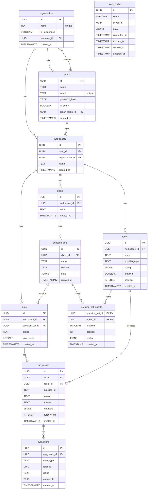

```mermaid
erDiagram
    organizations {
        UUID id PK
        TEXT name "unique"
        BOOLEAN is_suspended
        UUID manager_id FK
        TIMESTAMPTZ created_at
    }

    users {
        UUID id PK
        TEXT name
        TEXT email "unique"
        TEXT password_hash
        BOOLEAN is_admin
        UUID organization_id FK
        TIMESTAMPTZ created_at
    }

    workspaces {
        UUID id PK
        UUID user_id FK
        UUID organization_id FK
        TEXT name
        TIMESTAMPTZ created_at
    }

    clients {
        UUID id PK
        UUID workspace_id FK
        TEXT name
        TIMESTAMPTZ created_at
    }

    agents {
        UUID id PK
        UUID workspace_id FK
        TEXT name
        TEXT provider_type
        JSONB config
        BOOLEAN enabled
        INTEGER position
        TIMESTAMPTZ created_at
    }

    question_sets {
        UUID id PK
        UUID client_id FK
        TEXT name
        TEXT version
        JSONB data
        TIMESTAMPTZ created_at
    }

    runs {
        UUID id PK
        UUID workspace_id FK
        UUID question_set_id FK
        TEXT status
        INTEGER total_tasks
        TIMESTAMPTZ created_at
    }

    run_results {
        UUID id PK
        UUID run_id FK
        UUID agent_id FK
        TEXT question_id
        TEXT status
        TEXT answer
        JSONB metadata
        INTEGER duration_ms
        TIMESTAMPTZ created_at
    }

    evaluations {
        UUID id PK
        UUID run_result_id FK
        TEXT rater_type
        UUID rater_id
        TEXT rating
        TEXT comments
        TIMESTAMPTZ created_at
    }

    stats_cache {
        UUID id PK
        VARCHAR scope
        UUID scope_id
        JSONB data
        TIMESTAMP computed_at
        TIMESTAMP expires_at
        TIMESTAMP created_at
        TIMESTAMP updated_at
    }

    question_set_agents {
        UUID question_set_id PK, FK
        UUID agent_id PK, FK
        BOOLEAN enabled
        INT position
        JSONB config
        TIMESTAMP created_at
    }

    organizations ||--o{ users : has
    organizations ||--o{ workspaces : has
    organizations }o--|| users : manager
    users ||--o{ workspaces : owns
    workspaces ||--o{ clients : has
    workspaces ||--o{ agents : has
    workspaces ||--o{ runs : has
    clients ||--o{ question_sets : has
    question_sets ||--o{ runs : used_in
    runs ||--o{ run_results : has
    agents ||--o{ run_results : produces
    run_results ||--o{ evaluations : has
    question_sets ||--o{ question_set_agents : config
    agents ||--o{ question_set_agents : config

```